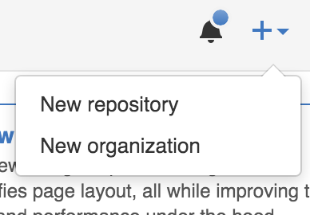

# Basic Git Course

### Index

### What is a Version Control Software?

Version control software allows you to have “versions” of a project, which show the changes that were made to the code
over time, and allows you to backtrack if necessary and undo those changes.

We also have the idea of centralized version control server, where multiple developer could pull the latest changes and
then push to the server the changes made. But what happens if the server is down. There's where Git comes in.

### What is Git?

With Git, the developers don’t just check out the current version of the files and work from them, they actually mirror
the entire version history. Each developer always has a complete copy of everything.

A central server is still used, but should the worst happen, then everything can still be restored from any of the
developers who have the latest versions.

Git takes “snapshots” of files, if files remain unchanged in a particular version, it simply links to the previous
files.

### What is GitHub?

Github is both a remote server, a community of developers, and a graphical web interface for managing your Git project.
It’s free to use for public repositories and low cost plans for private projects. Other two good examples for Git remote
servers are BitBucket and Stash.

### First steps

To start working on a project using git we have three choices, the first one is to create our own repository in one of
the previous server, forking a repository or pushing up one after initializing it from a local folder.

For this example we will cover the two first ones and we will choose GitHub as remote server.

Supposing that we already have a GitHub account, we need to go the the main page of the remote server and create the
repository. This is accomplished by clicking the `+` Icon and then selecting the right option of the dropdown menu.

After filling the needed information we will finally have our repository created. Once there we will be able to get a
local clone of it and start working.

To fork a repository that already exists on GitHub we should go to the repository's homepage and click the Fork
button provided to us.

After this you will have a perfect copy of the original repository but into your own repositories of GitHub.

To end up with the first steps to work with Git we will clone a repository into our local sandbox so we can start
working on a project. Go to the homepage of the repository and click the copy to clipboard button and then write the
following command into the command line.

`git clone https://github.com/troianoandres/git-course.git`

The only difference you must have is the URL of the repository to be cloned. After you run this command you should have
locally cloned the entire project.

### Working with git

We will cover 3 of the most important commands you must know to work with Git. Those are `git pull`, `git commit`,
`git push`

#### git pull

Is a command used to get all the latest changes made to the repository, this will update all git history, files and
branches. To run this command just type `git pull` into the command line.

#### git commit

Is a command used to make a snapshot of the current changes, to make the changes be saved into the snapshot you must
stage them into the commit files. To add the `README.md` file to the commit files you should run `git add README.md`
into the command line.

To check the status of the staging process you could run `git status` and it will show you the changes to be committed.

Then when you are ready to commit the changes you should run `git commit -m "(...)"` where `(...)` is the commit message.
We must use a representative message for each commit, allowing us to know which is the purpose of the commit. We should
also have in mind to make each commit as atomic as possible, allowing us to revert the changes if needed.

#### git push

When you have made all the changes you want, and they are all committed you must push all to the server. To
accomplish this you should run `git push origin (branch)`, where `(branch)` is the branch where you want the
changes to be pushed. What is a branch will be covered in the next section.

### Collaborating into a project with git

When collaborating into a project you must be aware that multiple developers are pushing changes to the server all the
time. If you work into a feature and someone make some changes to the same files you are currently working on you'll
have serveral problems. To avoid this kind of issues we have the possibility to create a branch, which is a different
line of development from the master of the repository. A branch allows you to work into a feature without having conflicts
with other developers and then when you finished working on it you can merge it to the master branch to add you feature.

You must have your branch the most updated as possible, if wanted to, this will help us to avoid conflicts into our
development.

When working on a branch you will work the same way as you were before, you will merge the branch into master later on
using the remote server interface.

To create a branch you should run `git checkout (branch)`, where `(branch)` is the desired name for the branch.

#### Creating a pull requrest

When you finished working on a specific feature you must create a pull request, allowing other developers to see your
code and approve it. To open a pull request on GitHub you must click into the `New pull request` button and then
change the base fork to point out the repository you want to merge your changes.

Usually you will have to change it if you are working on a forked repository since the base fork is always into the
original repository. To change it you should select the desired repository from the dropdown list.

When all this changed are made you should click into the `Create pull request` button and the pull request must be
created. Once the pull request is reviewed you are finally able to merge it.

